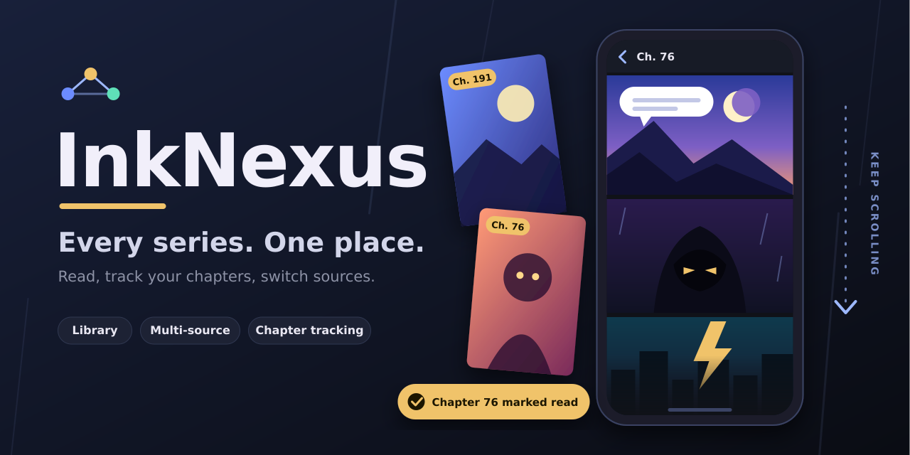

# InkNexus

**Every series. One place.**

A single-file, mobile-friendly webtoon and manhwa tracker and reader.

- **Library** with cover grid and last-chapter-read tracking
- **Multiple sources per series**: switch between them, hide the ones you don't use, and the app remembers your pick
- **Built-in reader** (vertical scroll) for MangaDex chapters, with sort and official-site chapters marked
- **AniList search** for metadata and official English reading links
- **Link-only sources** for any other site: paste a chapter link and the app reads the chapter number, learns the URL pattern where possible, and offers Continue / Next
- Export and import your library as JSON

InkNexus does not host, scrape or copy chapter images from sites that don't offer an API. Other sites are added as links you open yourself.

## Run it

It is one static file, `index.html`. No build step.

### Vercel
1. Push this repo to GitHub.
2. On vercel.com choose Add New > Project, import the repo.
3. Framework preset: **Other**. Leave build command and output directory empty. Deploy.

### Cloudflare proxy (needed for MangaDex search)
Browsers block direct calls to the MangaDex API, so `worker/worker.js` relays them.
1. Create a Worker on Cloudflare and paste in `worker/worker.js`.
2. Edit `ALLOWED` at the top to your deployed site address, then deploy.
3. Copy the worker's URL (for example `https://name.account.workers.dev`).

The worker only forwards requests to `api.mangadex.org`, and only for the site(s) in `ALLOWED`.

### Connecting a device (keeps the proxy out of the repo)
The proxy address is not stored in this repo. Open this once on each device and browser you use:

`https://YOUR-SITE.vercel.app/#proxy=https://your-worker.workers.dev`

The app saves it in that browser's storage and removes it from the address bar. You can also paste it under Find > Connection settings. Backups never contain the proxy.

## Data
Your library is stored in your browser's local storage, separately for each browser and each installed home-screen shortcut. Use Export backup regularly and Import to move a library between browsers.
